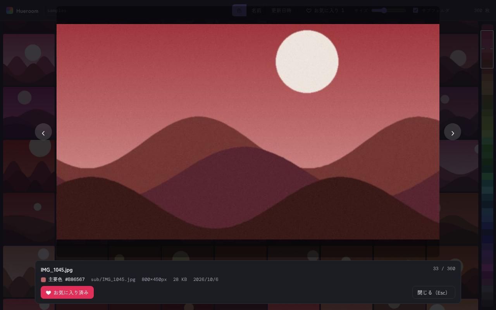

# Hueroom

フォルダの画像を、**色のグラデーションでつながるように並べて**眺められるギャラリー。
Web 版のプロトタイプです（Vite + React + TypeScript）。

| 色順（蛇行配置）とカラーバー | 拡大表示とお気に入り |
| --- | --- |
|  |  |

> スクリーンショットの画像は、動作確認用に生成したダミーの風景画像です。

## 起動方法

```bash
npm install
npm run dev        # 開発サーバー（http://localhost:5173）
npm run build      # 型チェック + 本番ビルド（dist/）
npm run preview    # ビルド結果の確認
npm test           # ユニットテスト（Vitest）
```

Node.js 20 以上を想定しています。

### 使い方

1. 「フォルダを選ぶ」で画像のあるフォルダを選びます（jpg / jpeg / png / webp / gif。サブフォルダも対象。`.` で始まるファイルとフォルダは除外）。
2. 解析（主要色の抽出とサムネイル生成）が進むにつれて、色順に並び替わります。結果は IndexedDB に保存されるので、2 回目以降は一瞬で開きます。
3. 右端のカラーバーをタップ／ドラッグすると、その色の位置へジャンプします。
4. 画像をクリックすると拡大表示します（← → で前後、Esc で閉じる）。**お気に入りは拡大表示のボタン（または F キー）で登録・解除**します。
5. ツールバーの「お気に入り」で、お気に入りだけに絞り込めます。カラーバーには、お気に入りの位置に白い目印が付きます。

### ブラウザごとの違い

| ブラウザ | フォルダの選び方 | 次回起動時 |
| --- | --- | --- |
| Chrome / Edge | File System Access API（`showDirectoryPicker`） | ハンドルを IndexedDB に保存。許可の再確認だけで開ける |
| Safari / Firefox | `<input webkitdirectory>` | 毎回フォルダを選ぶ |

`?adapter=input` を URL に付けると、Chrome でもフォールバック版を強制できます（自動テスト用）。

## 仕組み

### 色抽出（`src/core/color`）

1. 画像を中央の正方形に切り出して 224px のサムネイル（WebP。書き出せない環境では JPEG）にし、そこから 32×32 に縮小します。タイルに見えている範囲の色になります。
2. 32×32 の画素を OKLab に変換し（半透明は除外、白飛び・黒潰れは重みを下げる）、k-means++（k=5、固定シードで結果は決定的）でクラスタリングします。
3. `占有率 × (0.04 + 彩度C)` が最大のクラスタを主要色にします。単純な平均色ではなく、面積が小さくても鮮やかな色が選ばれやすく、全体が低彩度なら最大面積の色になります。
4. 処理は Web Worker（OffscreenCanvas）のプールで行います。使えない環境ではメインスレッドで処理します。

キャッシュのキーは `パス + 更新日時 + サイズ`（`src/core/keys.ts`）。お気に入りも同じキーです。**ファイル名を変えると別の画像として扱われ、お気に入りも外れます。**

### 並び順（`src/core/sort`）

- **色順**: 彩度が低い画像（C < 0.04）は別グループにして、明度の高い順で末尾に置きます。有彩色は色相で 12 帯に分け、帯ごとに明暗の向きを交互に折り返します（偶数帯は暗→明、奇数帯は明→暗）。帯の中は OKLab 距離の最近傍法で、隣同士の色差を小さくします。1 つの帯が 1,500 枚を超える場合は、計算量を抑えるため明度順にします。解析前の画像は最後に置きます。
- **名前順**（自然順）/ **更新日時順**: どちらも昇順・降順を切り替えられます。

### 表示（`src/ui`）

- 色順のときは**蛇行配置**（奇数行を左右反転）で、行の折り返しで色が飛びません（`src/core/layout/snake.ts`）。
- 表示範囲の行だけを描画する**仮想スクロール**です。サムネイルの object URL は、タイルが画面から外れたときに解放します。画像を読み込む前は、主要色で塗ったプレースホルダを出します。
- 解析中の並び替えは 0.5 秒ごとにまとめて反映します。

### 動作確認の結果（ヘッドレス Chromium、ソフトウェア描画）

| 項目 | 結果 |
| --- | --- |
| 2,304 枚（640×480 前後の JPEG）の初回解析 | 約 13 秒 |
| 同じフォルダの 2 回目（キャッシュ） | 約 0.2 秒 |
| 2,304 枚をスクロール中のフレーム間隔 | 中央値 約 17ms、95 パーセンタイル 約 29ms |
| DOM 上のタイル数 | 約 80〜130（全体の枚数に依存しない） |

実機の GPU 環境での計測ではありません。目安として扱ってください。

## ディレクトリ構成

```
src/
├─ core/                  プラットフォーム非依存（共通コード）
│  ├─ color/              oklab.ts（色空間）/ quantize.ts（主要色）/ extract.ts（canvas 処理）
│  ├─ sort/               hueBands.ts（色順）/ index.ts（名前・日時）
│  ├─ layout/snake.ts     蛇行配置の対応表
│  ├─ cache/              解析キャッシュ・お気に入り（IndexedDB）
│  ├─ pipeline/           解析キューと Worker プール
│  └─ storage/idb.ts      IndexedDB の最小ラッパー
├─ platform/              ★ プラットフォーム別アダプタ（ここだけ差し替える）
│  ├─ types.ts            FolderAdapter インターフェース
│  └─ web/                File System Access / input フォールバック
└─ ui/                    React（VirtualGrid / ColorBar / Lightbox / Toolbar）
```

`core/` と `ui/` はブラウザ固有の「フォルダ取得」API を直接呼びません。`platform/types.ts` の `FolderAdapter` だけに依存します。

## 各プラットフォームへ展開する次の手順

どの場合も、実装するのは `FolderAdapter`（`pickFolder` / `restoreLast` / `listImages`、PC は `watch`）と、`ImageFileRef.getFile()`（実体の遅延読み込み）です。表示・色抽出・ソートは変更しません。

### Web（公開 + PWA）

1. `public/manifest.webmanifest` は用意済みです。PNG アイコン（192 / 512px、maskable）を追加します。
2. `vite-plugin-pwa` を入れて Service Worker を生成し、アプリ本体をオフラインでも開けるようにします。
3. 静的ホスティング（Cloudflare Pages / GitHub Pages など）に `dist/` を置きます。HTTPS が必要です。
4. Google Fonts を外部から読んでいます。オフライン対応時はフォントを同梱してください。

### Android（Capacitor）

1. `npm i @capacitor/core @capacitor/cli @capacitor/android` → `npx cap init` → `npm run build` → `npx cap add android`。
2. `ACTION_OPEN_DOCUMENT_TREE`（Storage Access Framework）を呼ぶ自作プラグインを書きます。ツリー URI を `takePersistableUriPermission` で保存すると、次回は許可の再確認なしで開けます。
3. `platform/capacitor/` に `FolderAdapter` を実装します。`listImages` は `DocumentFile` を辿って `path / lastModified / size` を返し、`getFile()` は URI から `Blob` を返します（大量の画像は `Capacitor.convertFileSrc` やネイティブ側のサムネイル生成も検討）。
4. 注意: WebView の Worker + OffscreenCanvas は端末の WebView バージョンに依存します。無い場合は `createExtractor()` がメインスレッド処理に切り替えます。

### iOS（Capacitor）

1. `npx cap add ios`。
2. `UIDocumentPickerViewController`（フォルダ選択）で得た URL から security-scoped bookmark を作って保存し、次回はそれを解決して `startAccessingSecurityScopedResource()` を呼ぶプラグインを書きます。
3. `FolderAdapter` は Android と同様に実装します。iOS の WebView（WKWebView）は WebP のエンコードに対応しないことがあります。その場合は JPEG にフォールバックします（実装済み）。

### PC（Tauri）

1. `npm i -D @tauri-apps/cli` → `npx tauri init`。
2. `@tauri-apps/plugin-dialog`（フォルダ選択）と `@tauri-apps/plugin-fs`（`readDir` / `stat` / `readFile`、`watch`）で `FolderAdapter` を実装します。`watch` で変更を検知したら再列挙します。
3. 前回のフォルダのパスは、Tauri の store プラグインなどに保存します。

## 既知の制限

- File System Access 版（Chrome / Edge の `showDirectoryPicker`）は、ヘッドレス環境ではピッカーを操作できないため、列挙のロジックはユニットテストで、画面は `?adapter=input` のフォールバック版で確認しています。実際の Chrome でのピッカーと「前回のフォルダを開く」の動作は、手元で確認してください。
- EXIF の回転は、ブラウザの既定（`createImageBitmap`）に従います。
- GIF は先頭のフレームだけを使います。
- サムネイルはすべてメモリ上に保持します（1 枚あたり 10〜20KB 程度）。数万枚では、必要なぶんだけ読み込む方式への変更が必要です。
